# 立体多层停车场管理系统功能模块封装函数原型与调用关系

## 一、说明

根据系统业务需求和三人分工，本系统按照功能职责划分为以下模块：

1. 数据结构基础模块：由 pzx 负责，主要实现系统初始化、空闲车位栈、等待队列、车牌哈希表和辅助函数。
2. 停车业务处理模块：由 yjk 负责，主要实现车辆入场、车辆出场、车辆查找和排队调度。
3. 计费模块：由 yjk 负责，主要实现停车费用计算和计费规则设置。
4. 统计分析模块：由 zxc 负责，主要实现收入统计、楼层热度分析、历史交易和高峰时段分析。
5. 用户界面模块：由 zxc 负责，主要实现菜单交互和各功能入口。
6. 数据持久化模块：由 zxc 负责，主要实现数据保存、数据加载和索引重建。
7. 主控模块：由 zxc 负责，主要实现程序入口、初始化、菜单循环和退出清理。

下文分别给出各模块的封装函数原型，并说明函数名、参数类型、参数含义、输入范围、返回值类型、返回值含义和输出范围。

## 二、数据结构基础模块函数原型

数据结构基础模块主要文件为 `ds.h` 和 `ds.c`。

### 2.1 系统初始化与销毁

```c
void ds_init(ParkingSystem *ps);
```

函数说明：初始化停车场系统。

参数说明：

- `ps`
  - 类型：`ParkingSystem *`
  - 含义：停车场系统全局状态指针。
  - 输入范围：不能为空；应指向一个已定义但尚未初始化或准备重新初始化的 `ParkingSystem` 变量。

返回值说明：

- 类型：`void`
- 含义：无返回值。
- 输出范围：函数执行后，`ps` 中所有车位为空闲状态，空闲车位栈包含全部 60 个车位，等待队列为空，哈希表为空，历史记录数组容量为初始值，默认计费规则生效。

```c
void ds_destroy(ParkingSystem *ps);
```

函数说明：销毁停车场系统并释放动态内存。

参数说明：

- `ps`
  - 类型：`ParkingSystem *`
  - 含义：停车场系统全局状态指针。
  - 输入范围：可以为空；如果非空，应为已经调用过 `ds_init` 的系统对象。

返回值说明：

- 类型：`void`
- 含义：无返回值。
- 输出范围：释放 `free_spots.spots`、等待队列节点、哈希表节点、`history` 动态数组，并将相关指针或计数恢复为空状态。

### 2.2 空闲车位栈操作

```c
void stack_init(FreeSpotStack *s, int capacity);
```

函数说明：初始化空闲车位栈。

参数说明：

- `s`
  - 类型：`FreeSpotStack *`
  - 含义：待初始化的空闲车位栈指针。
  - 输入范围：不能为空。
- `capacity`
  - 类型：`int`
  - 含义：栈的初始容量。
  - 输入范围：正整数，通常为 `TOTAL_SPOTS`，即 60。

返回值说明：

- 类型：`void`
- 输出范围：初始化后 `s->top == -1`，`s->capacity == capacity`，`s->spots` 指向动态数组。

```c
void stack_destroy(FreeSpotStack *s);
```

函数说明：销毁空闲车位栈。

参数说明：

- `s`
  - 类型：`FreeSpotStack *`
  - 含义：空闲车位栈指针。
  - 输入范围：可以为空；非空时应为已初始化栈。

返回值说明：

- 类型：`void`
- 输出范围：释放 `s->spots`，并将 `s->spots` 置为 `NULL`，`top` 置为 `-1`，`capacity` 置为 `0`。

```c
void stack_push(FreeSpotStack *s, SpotLocation loc);
```

函数说明：将一个空闲车位坐标压入栈。

参数说明：

- `s`
  - 类型：`FreeSpotStack *`
  - 含义：空闲车位栈指针。
  - 输入范围：不能为空；应为已初始化栈。
- `loc`
  - 类型：`SpotLocation`
  - 含义：需要压入栈的车位坐标。
  - 输入范围：`loc.floor` 范围为 `0 ~ FLOORS-1`；`loc.row` 范围为 `0 ~ ROWS-1`；`loc.col` 范围为 `0 ~ COLS-1`。

返回值说明：

- 类型：`void`
- 输出范围：栈元素数量增加 1；如果容量不足，内部进行扩容。

```c
SpotLocation stack_pop(FreeSpotStack *s);
```

函数说明：从空闲车位栈弹出一个车位坐标。

参数说明：

- `s`
  - 类型：`FreeSpotStack *`
  - 含义：空闲车位栈指针。
  - 输入范围：不能为空；栈不能为空。

返回值说明：

- 类型：`SpotLocation`
- 含义：栈顶车位坐标。
- 输出范围：返回值中 `floor`、`row`、`col` 均应在合法车位坐标范围内。

```c
int stack_is_empty(const FreeSpotStack *s);
```

函数说明：判断空闲车位栈是否为空。

参数说明：

- `s`
  - 类型：`const FreeSpotStack *`
  - 含义：空闲车位栈指针。
  - 输入范围：可以为空。

返回值说明：

- 类型：`int`
- 含义：栈是否为空。
- 输出范围：返回非 0 表示为空；返回 0 表示非空。

```c
int stack_size(const FreeSpotStack *s);
```

函数说明：获取当前空闲车位数量。

参数说明：

- `s`
  - 类型：`const FreeSpotStack *`
  - 含义：空闲车位栈指针。
  - 输入范围：可以为空。

返回值说明：

- 类型：`int`
- 含义：当前栈中元素个数。
- 输出范围：`0 ~ capacity`，在本项目中通常为 `0 ~ TOTAL_SPOTS`。

### 2.3 等待队列操作

```c
void queue_init(WaitingQueue *q);
```

函数说明：初始化等待队列。

参数说明：

- `q`
  - 类型：`WaitingQueue *`
  - 含义：等待队列指针。
  - 输入范围：不能为空。

返回值说明：

- 类型：`void`
- 输出范围：初始化后 `front == NULL`，`rear == NULL`，`count == 0`。

```c
void queue_clear(WaitingQueue *q);
```

函数说明：清空等待队列。

参数说明：

- `q`
  - 类型：`WaitingQueue *`
  - 含义：等待队列指针。
  - 输入范围：可以为空；非空时应为已初始化队列。

返回值说明：

- 类型：`void`
- 输出范围：释放所有等待节点，队列恢复为空。

```c
void queue_enqueue(WaitingQueue *q, const char *plate, time_t t);
```

函数说明：将车辆加入等待队列队尾。

参数说明：

- `q`
  - 类型：`WaitingQueue *`
  - 含义：等待队列指针。
  - 输入范围：不能为空。
- `plate`
  - 类型：`const char *`
  - 含义：等待车辆车牌号。
  - 输入范围：非空字符串，长度范围为 `1 ~ 15`。
- `t`
  - 类型：`time_t`
  - 含义：车辆进入等待队列的时间。
  - 输入范围：合法系统时间，通常由 `time(NULL)` 得到。

返回值说明：

- 类型：`void`
- 输出范围：队列长度增加 1，新节点成为队尾。

```c
int queue_dequeue(WaitingQueue *q, char *out_plate, time_t *out_t);
```

函数说明：从等待队列队头取出一辆车。

参数说明：

- `q`
  - 类型：`WaitingQueue *`
  - 含义：等待队列指针。
  - 输入范围：不能为空。
- `out_plate`
  - 类型：`char *`
  - 含义：输出队头车辆车牌号。
  - 输入范围：可以为空；如果非空，应至少能保存 16 个字符。
- `out_t`
  - 类型：`time_t *`
  - 含义：输出队头车辆进入等待队列的时间。
  - 输入范围：可以为空。

返回值说明：

- 类型：`int`
- 含义：出队是否成功。
- 输出范围：返回 `1` 表示成功出队；返回 `0` 表示队列为空。

```c
int queue_is_empty(const WaitingQueue *q);
```

函数说明：判断等待队列是否为空。

参数说明：

- `q`
  - 类型：`const WaitingQueue *`
  - 含义：等待队列指针。
  - 输入范围：可以为空。

返回值说明：

- 类型：`int`
- 输出范围：非 0 表示队列为空；0 表示非空。

```c
int queue_count(const WaitingQueue *q);
```

函数说明：获取等待队列中的车辆数量。

参数说明：

- `q`
  - 类型：`const WaitingQueue *`
  - 含义：等待队列指针。
  - 输入范围：可以为空。

返回值说明：

- 类型：`int`
- 输出范围：`0` 或正整数，表示当前等待车辆数量。

### 2.4 车牌哈希表操作

```c
unsigned int hash_str(const char *str);
```

函数说明：计算字符串哈希值。

参数说明：

- `str`
  - 类型：`const char *`
  - 含义：待计算哈希值的字符串，一般为车牌号。
  - 输入范围：可以为空；非空时为普通字符串。

返回值说明：

- 类型：`unsigned int`
- 输出范围：`0 ~ HT_SIZE-1`。

```c
void ht_init(HashMap *ht);
```

函数说明：初始化车牌哈希表。

参数说明：

- `ht`
  - 类型：`HashMap *`
  - 含义：哈希表指针。
  - 输入范围：不能为空。

返回值说明：

- 类型：`void`
- 输出范围：所有桶置为 `NULL`，`count` 置为 0。

```c
void ht_insert(HashMap *ht, VehicleRecord *rec);
```

函数说明：插入车辆在场记录索引。

参数说明：

- `ht`
  - 类型：`HashMap *`
  - 含义：哈希表指针。
  - 输入范围：不能为空。
- `rec`
  - 类型：`VehicleRecord *`
  - 含义：车辆在场记录指针。
  - 输入范围：不能为空；`rec->plate` 应为合法车牌字符串。

返回值说明：

- 类型：`void`
- 输出范围：哈希表记录数量增加 1。

```c
VehicleRecord *ht_find(HashMap *ht, const char *plate);
```

函数说明：根据车牌查找在场车辆记录。

参数说明：

- `ht`
  - 类型：`HashMap *`
  - 含义：哈希表指针。
  - 输入范围：不能为空。
- `plate`
  - 类型：`const char *`
  - 含义：待查找车牌号。
  - 输入范围：非空字符串，长度为 `1 ~ 15`。

返回值说明：

- 类型：`VehicleRecord *`
- 输出范围：找到时返回对应记录指针；未找到返回 `NULL`。

```c
void ht_remove(HashMap *ht, const char *plate);
```

函数说明：删除指定车牌的哈希索引。

参数说明：

- `ht`
  - 类型：`HashMap *`
  - 含义：哈希表指针。
  - 输入范围：不能为空。
- `plate`
  - 类型：`const char *`
  - 含义：待删除车牌号。
  - 输入范围：非空字符串，长度为 `1 ~ 15`。

返回值说明：

- 类型：`void`
- 输出范围：如果找到对应节点，则删除该节点并使 `count` 减 1；未找到则不改变哈希表。

```c
void ht_clear(HashMap *ht);
```

函数说明：清空哈希表。

参数说明：

- `ht`
  - 类型：`HashMap *`
  - 含义：哈希表指针。
  - 输入范围：可以为空。

返回值说明：

- 类型：`void`
- 输出范围：释放所有哈希节点，所有桶置空，`count` 置为 0。

### 2.5 坐标辅助操作

```c
SpotLocation make_loc(int f, int r, int c);
```

函数说明：创建车位坐标。

参数说明：

- `f`
  - 类型：`int`
  - 含义：楼层编号。
  - 输入范围：`0 ~ FLOORS-1`。
- `r`
  - 类型：`int`
  - 含义：行编号。
  - 输入范围：`0 ~ ROWS-1`。
- `c`
  - 类型：`int`
  - 含义：列编号。
  - 输入范围：`0 ~ COLS-1`。

返回值说明：

- 类型：`SpotLocation`
- 输出范围：包含指定 `floor`、`row`、`col` 的坐标结构体。

```c
int loc_equal(SpotLocation a, SpotLocation b);
```

函数说明：判断两个车位坐标是否相同。

参数说明：

- `a`
  - 类型：`SpotLocation`
  - 含义：第一个车位坐标。
  - 输入范围：合法或待比较的坐标。
- `b`
  - 类型：`SpotLocation`
  - 含义：第二个车位坐标。
  - 输入范围：合法或待比较的坐标。

返回值说明：

- 类型：`int`
- 输出范围：非 0 表示相同；0 表示不同。

## 三、停车业务处理模块函数原型

停车业务处理模块主要文件为 `parking.h` 和 `parking.c`。

```c
EntryResult vehicle_entry(ParkingSystem *ps, const char *plate);
```

函数说明：办理车辆入场。

参数说明：

- `ps`
  - 类型：`ParkingSystem *`
  - 含义：停车场系统指针。
  - 输入范围：不能为空。
- `plate`
  - 类型：`const char *`
  - 含义：入场车辆车牌号。
  - 输入范围：非空字符串，长度范围为 `1 ~ 15`。

返回值说明：

- 类型：`EntryResult`
- 输出范围：
  - `ENTRY_SUCCESS`：车辆成功入场，并已分配车位。
  - `PARKING_FULL`：停车场已满，车辆已加入等待队列。
  - `PLATE_EXISTS`：车牌非法、车辆已在场或车辆已在等待队列中。

```c
ExitResult vehicle_exit(ParkingSystem *ps, const char *plate, double *out_fee);
```

函数说明：办理车辆出场结算。

参数说明：

- `ps`
  - 类型：`ParkingSystem *`
  - 含义：停车场系统指针。
  - 输入范围：不能为空。
- `plate`
  - 类型：`const char *`
  - 含义：出场车辆车牌号。
  - 输入范围：非空字符串，长度范围为 `1 ~ 15`。
- `out_fee`
  - 类型：`double *`
  - 含义：输出本次停车费用。
  - 输入范围：可以为空；如果非空，函数会写入费用。

返回值说明：

- 类型：`ExitResult`
- 输出范围：
  - `PARK_EXIT_SUCCESS`：车辆成功出场。
  - `NOT_FOUND`：系统中未找到该车辆。
  - `NOT_PARKED`：车辆在等待队列中，但尚未真正停车。

```c
VehicleRecord *find_vehicle(ParkingSystem *ps, const char *plate);
```

函数说明：查找在场车辆。

参数说明：

- `ps`
  - 类型：`ParkingSystem *`
  - 含义：停车场系统指针。
  - 输入范围：不能为空。
- `plate`
  - 类型：`const char *`
  - 含义：待查找车牌号。
  - 输入范围：非空字符串，长度范围为 `1 ~ 15`。

返回值说明：

- 类型：`VehicleRecord *`
- 输出范围：找到时返回在场车辆记录指针；未找到返回 `NULL`。

```c
int find_in_queue(ParkingSystem *ps, const char *plate);
```

函数说明：查找车辆在等待队列中的位置。

参数说明：

- `ps`
  - 类型：`ParkingSystem *`
  - 含义：停车场系统指针。
  - 输入范围：不能为空。
- `plate`
  - 类型：`const char *`
  - 含义：待查找车牌号。
  - 输入范围：非空字符串，长度范围为 `1 ~ 15`。

返回值说明：

- 类型：`int`
- 输出范围：找到时返回从 1 开始的排队序号；未找到返回 `-1`。

## 四、计费模块函数原型

计费模块主要文件为 `fee.h` 和 `fee.c`。

```c
double calculate_fee(const FeeRule *rule, int duration_minutes);
```

函数说明：根据停车时长计算停车费用。

参数说明：

- `rule`
  - 类型：`const FeeRule *`
  - 含义：计费规则指针。
  - 输入范围：不能为空；其中 `base_fee >= 0`，`free_minutes >= 0`，`rate_per_hour >= 0`，`max_daily >= 0`。
- `duration_minutes`
  - 类型：`int`
  - 含义：停车时长，单位为分钟。
  - 输入范围：`>= 0`。

返回值说明：

- 类型：`double`
- 输出范围：`>= 0`。如果停车时长小于等于免费时长，返回 `0.0`；否则返回按规则计算出的费用。

```c
void set_fee_rule(ParkingSystem *ps, FeeRule rule);
```

函数说明：设置停车场计费规则。

参数说明：

- `ps`
  - 类型：`ParkingSystem *`
  - 含义：停车场系统指针。
  - 输入范围：不能为空。
- `rule`
  - 类型：`FeeRule`
  - 含义：新的计费规则。
  - 输入范围：建议满足 `base_fee >= 0`，`free_minutes >= 0`，`rate_per_hour >= 0`，`max_daily >= 0`。

返回值说明：

- 类型：`void`
- 输出范围：函数执行后，`ps->fee_rule` 更新为新的计费规则。

## 五、统计分析模块函数原型

统计分析模块主要文件为 `stats.h` 和 `stats.c`。

```c
double stats_total_revenue(const ParkingSystem *ps);
```

函数说明：获取停车场累计收入。

参数说明：

- `ps`
  - 类型：`const ParkingSystem *`
  - 含义：停车场系统指针。
  - 输入范围：不能为空。

返回值说明：

- 类型：`double`
- 输出范围：`>= 0`。

```c
int stats_floor_used_count(const ParkingSystem *ps, int floor);
```

函数说明：统计指定楼层当前已占用车位数量。

参数说明：

- `ps`
  - 类型：`const ParkingSystem *`
  - 含义：停车场系统指针。
  - 输入范围：不能为空。
- `floor`
  - 类型：`int`
  - 含义：楼层编号。
  - 输入范围：`0 ~ FLOORS-1`。

返回值说明：

- 类型：`int`
- 输出范围：`0 ~ ROWS * COLS`，本项目中为 `0 ~ 20`。

```c
double stats_floor_usage_rate(const ParkingSystem *ps, int floor);
```

函数说明：计算指定楼层当前车位使用率。

参数说明：

- `ps`
  - 类型：`const ParkingSystem *`
  - 含义：停车场系统指针。
  - 输入范围：不能为空。
- `floor`
  - 类型：`int`
  - 含义：楼层编号。
  - 输入范围：`0 ~ FLOORS-1`。

返回值说明：

- 类型：`double`
- 输出范围：`0.0 ~ 1.0`。

```c
void stats_peak_hours(const ParkingSystem *ps, int hour_counts[24]);
```

函数说明：统计各小时车辆流量。

参数说明：

- `ps`
  - 类型：`const ParkingSystem *`
  - 含义：停车场系统指针。
  - 输入范围：不能为空。
- `hour_counts`
  - 类型：`int[24]`
  - 含义：保存 0 点到 23 点各小时车辆数量。
  - 输入范围：不能为空；数组长度必须至少为 24。

返回值说明：

- 类型：`void`
- 输出范围：函数执行后，`hour_counts[i]` 表示第 `i` 小时的统计数量，范围为 `>= 0`。

```c
void stats_print_transactions(const ParkingSystem *ps);
```

函数说明：输出历史交易记录。

参数说明：

- `ps`
  - 类型：`const ParkingSystem *`
  - 含义：停车场系统指针。
  - 输入范围：不能为空。

返回值说明：

- 类型：`void`
- 输出范围：向控制台输出历史交易明细。

## 六、用户界面模块函数原型

用户界面模块主要文件为 `ui.h` 和 `ui.c`。

```c
void ui_main_menu(ParkingSystem *ps);
```

函数说明：显示主菜单并处理用户操作。

参数说明：

- `ps`
  - 类型：`ParkingSystem *`
  - 含义：停车场系统指针。
  - 输入范围：不能为空。

返回值说明：

- 类型：`void`
- 输出范围：用户选择退出前，持续响应菜单操作。

```c
void ui_entry(ParkingSystem *ps);
```

函数说明：车辆入场菜单处理函数。

参数说明：

- `ps`
  - 类型：`ParkingSystem *`
  - 含义：停车场系统指针。
  - 输入范围：不能为空。

返回值说明：

- 类型：`void`
- 输出范围：读取用户输入车牌并调用 `vehicle_entry`，然后输出入场结果。

```c
void ui_exit(ParkingSystem *ps);
```

函数说明：车辆出场菜单处理函数。

参数说明：

- `ps`
  - 类型：`ParkingSystem *`
  - 含义：停车场系统指针。
  - 输入范围：不能为空。

返回值说明：

- 类型：`void`
- 输出范围：读取用户输入车牌并调用 `vehicle_exit`，然后输出出场结果和费用。

```c
void ui_find(ParkingSystem *ps);
```

函数说明：车辆查找菜单处理函数。

参数说明：

- `ps`
  - 类型：`ParkingSystem *`
  - 含义：停车场系统指针。
  - 输入范围：不能为空。

返回值说明：

- 类型：`void`
- 输出范围：输出车辆在场位置、排队位置或未找到提示。

```c
void ui_free_spots(ParkingSystem *ps);
```

函数说明：显示空闲车位数量。

参数说明：

- `ps`
  - 类型：`ParkingSystem *`
  - 含义：停车场系统指针。
  - 输入范围：不能为空。

返回值说明：

- 类型：`void`
- 输出范围：输出当前空闲车位数量，范围为 `0 ~ TOTAL_SPOTS`。

```c
void ui_wait_queue(ParkingSystem *ps);
```

函数说明：显示等待队列。

参数说明：

- `ps`
  - 类型：`ParkingSystem *`
  - 含义：停车场系统指针。
  - 输入范围：不能为空。

返回值说明：

- 类型：`void`
- 输出范围：输出当前等待车辆数量和车牌列表。

```c
void ui_parking_map(ParkingSystem *ps);
```

函数说明：显示停车场车位状态图。

参数说明：

- `ps`
  - 类型：`ParkingSystem *`
  - 含义：停车场系统指针。
  - 输入范围：不能为空。

返回值说明：

- 类型：`void`
- 输出范围：按楼层、行、列输出车位占用情况。

```c
void ui_revenue(ParkingSystem *ps);
```

函数说明：显示收入统计。

参数说明：

- `ps`
  - 类型：`ParkingSystem *`
  - 含义：停车场系统指针。
  - 输入范围：不能为空。

返回值说明：

- 类型：`void`
- 输出范围：输出累计收入等统计信息。

```c
void ui_transactions(ParkingSystem *ps);
```

函数说明：显示历史交易明细。

参数说明：

- `ps`
  - 类型：`ParkingSystem *`
  - 含义：停车场系统指针。
  - 输入范围：不能为空。

返回值说明：

- 类型：`void`
- 输出范围：输出历史交易记录列表。

```c
void ui_floor_usage(ParkingSystem *ps);
```

函数说明：显示楼层使用率。

参数说明：

- `ps`
  - 类型：`ParkingSystem *`
  - 含义：停车场系统指针。
  - 输入范围：不能为空。

返回值说明：

- 类型：`void`
- 输出范围：输出各楼层占用数量和使用率。

```c
void ui_peak_hours(ParkingSystem *ps);
```

函数说明：显示高峰时段分析。

参数说明：

- `ps`
  - 类型：`ParkingSystem *`
  - 含义：停车场系统指针。
  - 输入范围：不能为空。

返回值说明：

- 类型：`void`
- 输出范围：输出各小时车辆流量统计。

```c
void ui_save(ParkingSystem *ps);
```

函数说明：保存系统数据菜单处理函数。

参数说明：

- `ps`
  - 类型：`ParkingSystem *`
  - 含义：停车场系统指针。
  - 输入范围：不能为空。

返回值说明：

- 类型：`void`
- 输出范围：调用 `save_data` 并输出保存结果。

```c
void ui_load(ParkingSystem *ps);
```

函数说明：加载系统数据菜单处理函数。

参数说明：

- `ps`
  - 类型：`ParkingSystem *`
  - 含义：停车场系统指针。
  - 输入范围：不能为空。

返回值说明：

- 类型：`void`
- 输出范围：调用 `load_data` 并输出加载结果。

## 七、数据持久化模块函数原型

数据持久化模块主要文件为 `file_io.h` 和 `file_io.c`。

```c
int save_data(ParkingSystem *ps, const char *filename);
```

函数说明：保存停车场运行数据到文件。

参数说明：

- `ps`
  - 类型：`ParkingSystem *`
  - 含义：停车场系统指针。
  - 输入范围：不能为空。
- `filename`
  - 类型：`const char *`
  - 含义：保存文件名。
  - 输入范围：非空字符串。

返回值说明：

- 类型：`int`
- 输出范围：返回 `1` 表示保存成功；返回 `0` 表示保存失败。

```c
int load_data(ParkingSystem *ps, const char *filename);
```

函数说明：从文件加载停车场运行数据。

参数说明：

- `ps`
  - 类型：`ParkingSystem *`
  - 含义：停车场系统指针。
  - 输入范围：不能为空。
- `filename`
  - 类型：`const char *`
  - 含义：加载文件名。
  - 输入范围：非空字符串。

返回值说明：

- 类型：`int`
- 输出范围：返回 `1` 表示加载成功；返回 `0` 表示加载失败。

```c
void rebuild_hash_from_spots(ParkingSystem *ps);
```

函数说明：根据车位状态重建车牌哈希表。

参数说明：

- `ps`
  - 类型：`ParkingSystem *`
  - 含义：停车场系统指针。
  - 输入范围：不能为空；`spots` 中应包含加载后的车位状态。

返回值说明：

- 类型：`void`
- 输出范围：重新建立 `plate_index`，使所有占用车位中的车辆都能通过车牌查找到。

## 八、主控模块函数原型

主控模块主要文件为 `main.c`。

```c
int main(void);
```

函数说明：程序入口函数。

参数说明：

- 无参数。

返回值说明：

- 类型：`int`
- 输出范围：正常结束返回 `0`。

主流程：

1. 创建 `ParkingSystem ps`。
2. 调用 `ds_init(&ps)` 初始化系统。
3. 调用 `load_data(&ps, "parking_data.dat")` 尝试加载数据。
4. 调用 `ui_main_menu(&ps)` 进入菜单循环。
5. 退出前调用 `save_data(&ps, "parking_data.dat")` 保存数据。
6. 调用 `ds_destroy(&ps)` 释放系统资源。

## 九、函数调用关系

系统主要函数调用关系如下：

```mermaid
flowchart TD
    A[main] --> B[ds_init]
    A --> C[load_data]
    C --> C1[rebuild_hash_from_spots]
    A --> D[ui_main_menu]
    D --> E[ui_entry]
    D --> F[ui_exit]
    D --> G[ui_find]
    D --> H[ui_parking_map]
    D --> I[ui_revenue]
    D --> J[ui_transactions]
    D --> K[ui_floor_usage]
    D --> L[ui_peak_hours]
    D --> M[ui_save]
    D --> N[ui_load]

    E --> E1[vehicle_entry]
    E1 --> E2[ht_find]
    E1 --> E3[find_in_queue]
    E1 --> E4[stack_is_empty]
    E1 --> E5[stack_pop]
    E1 --> E6[ht_insert]
    E1 --> E7[queue_enqueue]

    F --> F1[vehicle_exit]
    F1 --> F2[ht_find]
    F1 --> F3[calculate_fee]
    F1 --> F4[ht_remove]
    F1 --> F5[queue_is_empty]
    F1 --> F6[queue_dequeue]
    F1 --> F7[stack_push]
    F1 --> F8[ht_insert]

    G --> G1[find_vehicle]
    G --> G2[find_in_queue]
    G1 --> G3[ht_find]

    I --> I1[stats_total_revenue]
    J --> J1[stats_print_transactions]
    K --> K1[stats_floor_used_count]
    K --> K2[stats_floor_usage_rate]
    L --> L1[stats_peak_hours]

    M --> M1[save_data]
    N --> N1[load_data]

    A --> O[save_data]
    A --> P[ds_destroy]
```



文字说明：

1. `main` 是系统入口，负责初始化、加载数据、进入菜单、保存数据和释放资源。
2. `ui_main_menu` 是用户操作中心，根据菜单选择调用不同 UI 子函数。
3. UI 层不直接完成业务，而是调用 yjk 的 `vehicle_entry`、`vehicle_exit`、`find_vehicle`、`find_in_queue`。
4. yjk 业务层调用 pzx 的栈、队列和哈希表函数完成底层数据操作。
5. 统计模块主要读取 `ParkingSystem` 中的 `history`、`spots` 和 `total_revenue`。
6. 文件持久化模块负责保存和加载系统状态，加载后需要重建哈希表索引。

## 十、总结

本系统通过函数封装将不同职责分离：

- pzx 的函数负责数据结构底层操作。
- yjk 的函数负责停车业务流程和计费。
- zxc 的函数负责界面、统计、文件保存加载和程序主控。

这种函数划分方式可以降低模块耦合度，使三人能够并行开发，也方便后期测试、维护和报告说明。
