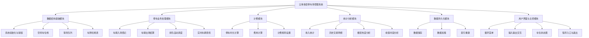

# 立体多层停车场管理系统功能分析与功能结构图

## 一、用户业务需求分析

立体多层停车场管理系统面向停车场日常运营管理，核心目标是让车辆入场、出场、车位分配、排队、查找、收费和统计都能够自动完成，减少人工登记和人工查找带来的低效率与错误。

根据业务场景，系统需要满足以下需求：

| 序号 | 用户业务需求 | 需求说明 |
|---|---|---|
| 1 | 快速办理车辆入场 | 用户车辆到达停车场入口后，系统应快速判断是否有空位，并自动分配车位。 |
| 2 | 快速办理车辆出场 | 用户离场时，系统应查找到车辆记录，计算停车时长和费用，并释放车位。 |
| 3 | 高效管理多层车位 | 停车场有 3 层、每层 4 行 5 列，共 60 个车位，需要统一管理车位状态。 |
| 4 | 停车场满位时支持排队 | 当无空车位时，新到车辆不能丢失，应进入等待队列。 |
| 5 | 空位释放后自动调度 | 有车辆出场释放车位时，系统应优先安排等待队列中的车辆入场。 |
| 6 | 支持实时车辆查找 | 管理员应能根据车牌快速查询车辆是否在场、停放位置或排队位置。 |
| 7 | 自动计算停车费用 | 出场时根据免费时长、起步价、小时费率和封顶价自动计费。 |
| 8 | 支持运营统计 | 管理员需要查看总收入、历史交易、楼层使用热度和高峰时段。 |
| 9 | 支持数据保存和恢复 | 系统退出后应保存必要数据，重新启动后可恢复停车场状态。 |
| 10 | 操作界面清晰 | 管理员需要通过菜单完成常用操作，降低使用难度。 |

## 二、系统需要实现的功能

### 1. 系统初始化功能

具体内容：

- 创建 3 层、每层 4 行 5 列的车位模型。
- 将 60 个车位全部初始化为空闲状态。
- 初始化空闲车位栈、等待队列、车牌哈希表和历史交易数组。
- 设置默认计费规则和总收入初值。

对应解决的业务需求：

- 解决“高效管理多层车位”的需求。
- 为车辆入场、出场、查找、计费和统计提供统一的数据基础。

### 2. 车辆入场登记功能

具体内容：

- 输入车牌号。
- 判断车牌是否合法。
- 检查该车牌是否已经在场或已经排队。
- 如果有空闲车位，则自动分配车位并记录入场时间。
- 如果停车场已满，则将车辆加入等待队列。

对应解决的业务需求：

- 解决“快速办理车辆入场”的需求。
- 解决“停车场满位时支持排队”的需求。
- 避免同一车辆重复入场。

### 3. 空闲车位分配与释放功能

具体内容：

- 使用空闲车位栈保存所有可用车位。
- 入场时从栈顶弹出一个空闲车位，实现 O(1) 分配。
- 出场时释放原车位。
- 如果等待队列为空，则将释放车位压回空闲车位栈。

对应解决的业务需求：

- 解决“高效管理多层车位”的需求。
- 解决“快速办理车辆入场”和“快速办理车辆出场”的效率需求。

### 4. 车辆出场结算功能

具体内容：

- 根据车牌号在哈希表中查找车辆在场记录。
- 计算车辆停车时长。
- 调用计费模块计算停车费用。
- 生成历史交易记录。
- 更新总收入。
- 删除车辆在场记录。
- 释放车辆占用的车位。

对应解决的业务需求：

- 解决“快速办理车辆出场”的需求。
- 解决“自动计算停车费用”的需求。
- 为“运营统计”提供历史交易数据。

### 5. 等待队列与自动调度功能

具体内容：

- 当停车场已满时，新车辆进入等待队列。
- 等待队列采用 FIFO 原则，先到先服务。
- 有车辆出场后，如果等待队列非空，队首车辆立即获得刚释放的车位。
- 更新等待队列长度和车辆停放信息。

对应解决的业务需求：

- 解决“停车场满位时支持排队”的需求。
- 解决“空位释放后自动调度”的需求。
- 保证排队公平性。

### 6. 实时车辆查找功能

具体内容：

- 根据车牌号查询车辆是否在停车场内。
- 如果车辆在场，显示其楼层、行、列位置和入场时间。
- 如果车辆不在场，则继续查询是否在等待队列中。
- 如果都不存在，则提示未找到。

对应解决的业务需求：

- 解决“支持实时车辆查找”的需求。
- 降低人工查找车辆位置的时间成本。

### 7. 停车计费功能

具体内容：

- 支持默认计费规则：免费 15 分钟、起步价 5 元、每小时 4 元、每日封顶 40 元。
- 停车时长小于等于免费时长时不收费。
- 超过免费时长后，按超出部分向上取整计小时。
- 费用超过封顶价时按封顶价收取。
- 支持修改计费规则。

对应解决的业务需求：

- 解决“自动计算停车费用”的需求。
- 减少人工计费错误。

### 8. 车位状态显示功能

具体内容：

- 按楼层展示每个车位的空闲或占用状态。
- 显示当前空闲车位数量。
- 显示当前等待车辆数量。
- 可用 ASCII 图形式直观展示停车场布局。

对应解决的业务需求：

- 解决“高效管理多层车位”的需求。
- 解决“操作界面清晰”的需求。

### 9. 收入统计功能

具体内容：

- 统计系统累计收入。
- 可扩展统计今日收入、本月收入。
- 根据历史交易记录计算收入数据。

对应解决的业务需求：

- 解决“支持运营统计”的需求。
- 帮助管理员了解停车场经营情况。

### 10. 历史交易明细功能

具体内容：

- 保存每次车辆出场交易记录。
- 记录车牌、停车位置、入场时间、出场时间、停车时长和费用。
- 支持分页或列表查看历史交易。

对应解决的业务需求：

- 解决“支持运营统计”的需求。
- 为收入核对和业务追溯提供依据。

### 11. 楼层热度分析功能

具体内容：

- 统计不同楼层的车位使用情况。
- 分析各楼层使用率。
- 可用于判断哪些楼层更常被使用。

对应解决的业务需求：

- 解决“支持运营统计”的需求。
- 帮助停车场优化车位管理策略。

### 12. 峰值时段分析功能

具体内容：

- 根据车辆入场或交易记录统计各时段车辆流量。
- 分析停车高峰时间段。
- 为管理员安排人员和值班时间提供参考。

对应解决的业务需求：

- 解决“支持运营统计”的需求。
- 帮助优化运营调度。

### 13. 数据保存与加载功能

具体内容：

- 将停车场状态、历史交易、等待队列、收入和计费规则保存到文件。
- 系统启动时可从文件加载历史数据。
- 加载后重建必要的哈希索引。

对应解决的业务需求：

- 解决“支持数据保存和恢复”的需求。
- 避免程序关闭后业务数据丢失。

### 14. 菜单交互功能

具体内容：

- 提供循环菜单。
- 用户可选择车辆入场、车辆出场、车辆查找、查看车位、查看统计、保存数据、加载数据和退出系统。
- 对非法输入进行提示。

对应解决的业务需求：

- 解决“操作界面清晰”的需求。
- 让管理员无需了解代码即可完成业务操作。

## 三、功能模块划分

基于功能分析，系统可划分为以下模块：

| 模块 | 主要功能 | 负责内容 |
|---|---|---|
| 数据结构基础模块 | 系统初始化、空闲车位栈、等待队列、车牌哈希表、内存释放 | 提供底层数据结构和 O(1) 车位分配基础 |
| 停车业务处理模块 | 车辆入场、车辆出场、车辆查找、排队调度 | 处理停车场核心业务流程 |
| 计费模块 | 停车时长计算、费用计算、计费规则设置 | 完成自动收费 |
| 统计分析模块 | 收入统计、历史交易、楼层热度、峰值时段 | 支持运营管理 |
| 数据持久化模块 | 保存数据、加载数据、恢复系统状态 | 防止数据丢失 |
| 用户界面模块 | 菜单、输入输出、车位状态图 | 提供管理员操作入口 |
| 主控模块 | 程序入口、模块调度、退出清理 | 负责整体流程组织 |

## 四、系统功能结构图

下图展示系统功能模块及其下属功能。

## 五、功能与业务需求对应关系汇总

| 功能 | 解决的业务需求 |
|---|---|
| 系统初始化 | 建立多层车位模型，为所有业务提供初始数据。 |
| 车辆入场登记 | 快速处理车辆到达，自动分配车位或加入排队。 |
| 空闲车位栈 | 提高车位分配与释放效率。 |
| 车辆出场结算 | 快速完成车辆离场、收费和车位释放。 |
| 等待队列 | 停车场满位时保存等待车辆，并保证先到先服务。 |
| 自动调度 | 车位释放后自动安排等待车辆入场。 |
| 实时车辆查找 | 快速定位在场车辆或查询排队位置。 |
| 停车计费 | 根据停车时长和规则自动收费。 |
| 车位状态显示 | 帮助管理员直观看到停车场占用情况。 |
| 收入统计 | 支持经营收入分析。 |
| 历史交易明细 | 支持交易追溯和账目核对。 |
| 楼层热度分析 | 支持停车场空间使用分析。 |
| 峰值时段分析 | 支持运营调度和高峰管理。 |
| 数据保存与加载 | 防止业务数据丢失。 |
| 菜单交互 | 降低管理员使用难度。 |
